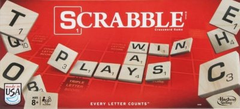
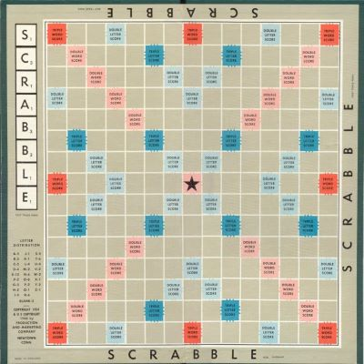
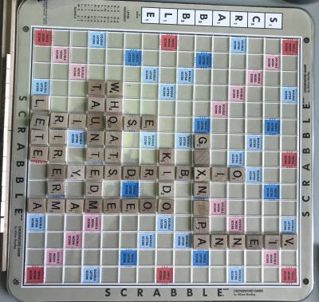

<div align="center">

```
.----------------.  .----------------.  .----------------.  .----------------.  .----------------.  .----------------.  .----------------.   
| .--------------. || .--------------. || .--------------. || .--------------. || .--------------. || .--------------. || .--------------. |  
| |    _______   | || |     ______   | || |      __      | || |   ______     | || |   ______     | || |   _____      | || |  _________   | |  
| |   /  ___  |  | || |   .' ___  |  | || |     /  \     | || |  |_   _ \    | || |  |_   _ \    | || |  |_   _|     | || | |_   ___  |  | |  
| |  |  (__ \_|  | || |  / .'   \_|  | || |    / /\ \    | || |    | |_) |   | || |    | |_) |   | || |    | |       | || |   | |_  \_|  | |  
| |   '.___`-.   | || |  | |         | || |   / ____ \   | || |    |  __'.   | || |    |  __'.   | || |    | |   _   | || |   |  _|  _   | |  
| |  |`\____) |  | || |  \ `.___.'\  | || | _/ /    \ \_ | || |   _| |__) |  | || |   _| |__) |  | || |   _| |__/ |  | || |  _| |___/ |  | |  
| |  |_______.'  | || |   `._____.'  | || ||____|  |____|| || |  |_______/   | || |  |_______/   | || |  |________|  | || | |_________|  | |  
| |              | || |              | || |              | || |              | || |              | || |              | || |              | |  
| '--------------' || '--------------' || '--------------' || '--------------' || '--------------' || '--------------' || '--------------' |  
'----------------'  '----------------'  '----------------'  '----------------'  '----------------'  '----------------'  '----------------'   
```

Play Scrabble with your friends without a physical game
</div>

What is this?
======================================================================================
--------------------------------------------------------------------------------------
This is a project designed by Kevin Hu and Nabhan Rashid designed for the purpose of playing Scrabble without the board.
This program also include the game of 3D Scrabble on top of the original, and multiple sizes of board for your enjoyment.

This document is meant to teach you how to use the program as a player.

Table of Contents:
======================================================================================
--------------------------------------------------------------------------------------
>### [Rules of Game](#rules-of-game)
>>#### [Rules of 3D Scrabble](#rules-of-3d-scrabble)
>### [Modifying the word list](#modifying-the-word-list)
>### [Starting a Game of Scrabble](#starting-a-game-of-scrabble)
>>#### [Loading a Game of Scrabble](#loading-a-game-of-scrabble)
>### [Playing a Move on Your Turn](#playing-a-move-on-your-turn)
>### [Quitting a Game of Scrabble](#quitting-a-game-of-scrabble)

Rules of Game
======================================================================================
--------------------------------------------------------------------------------------
In case you don't know how the original game of Scrabble works, **this section will teach you.**




Scrabble is played usually played with a *15x15 board* (Pictured below), 
and a set of pieces which the players place on it. Any other objects
(Such as piece holders, or a bag for the piece pile) are helpful, but unnecessary.



Your goal in the game is to win through having the most points. You gain points through placing valid words on the
board. **Words must be placed with 4 specific rules**

1. Words must be placed with at least one piece next to a previously placed piece.
2. After any piece placement, all pieces connected to one another in a line must create words when read left to right
or top to bottom.
3. You cannot place a piece upon another tile
4. Any piece you place must be adjacent to another piece in the same direction as a previously placed piece

**There is also an additional rule for the first player**, they must have at least one piece placed in the center of the
board

To get the most points, you must create words using uncommon letters, or by placing a piece on a tile with
a special modifier. The position of these modifiers are pictured above, and modify the pieces as follows:
> Red: Triple placed word's score
>> Any word using a piece on this tile will have triple the value
> 
> Blue: Triple placed piece's score
>> Any word using a piece on this tile will use three times the piece's value in its score
> 
> Light red: Double placed word's score
>> Any word using a piece on this tile will have double the value
> 
> Light blue: Double placed piece's score
>> Any word using a piece on this tile will use three times the piece's value in its score


 
Previously mentioned rarity of pieces, Scrabble has specific points assigned to each piece. The correlation of which is below.


| Piece | Value | Piece | Value | Piece | Value | Piece | Value |
|:-----:|:-----:|:-----:|:-----:|:-----:|:-----:|:-----:|:-----:|
|   A   |   1   |   B   |   3   |   C   |   3   |   D   |   2   |
|   E   |   1   |   F   |   4   |   G   |   2   |   H   |   4   |
|   I   |   1   |   J   |   8   |   K   |   5   |   L   |   1   |
|   M   |   3   |   N   |   1   |   O   |   1   |   P   |   3   |
|   Q   |  10   |   R   |   1   |   S   |   1   |   T   |   1   |
|   U   |   1   |   V   |   4   |   W   |   4   |   X   |   8   |
|   Y   |   4   |   Z   |  10   | Blank |   0   |  N/A  |  N/A  |

As you can see, the harder it is to think of a word, the more points it will give, so study your dictionary.

You may have noticed the "Blank" piece, it's a piece which can be anything you want it to be, however it must have
an identity, and must carry that identity for the rest of the game. It's a wild card, but in exchange it gives no points.

Similar to how often they are used in human language, the pieces also have a frequency. The correlation off which is below

| Piece | Count | Piece | Count | Piece | Count | Piece | Count |
|:-----:|:-----:|:-----:|:-----:|:-----:|:-----:|:-----:|:-----:|
|   A   |   9   |   B   |   2   |   C   |   2   |   D   |   4   |
|   E   |  12   |   F   |   2   |   G   |   3   |   H   |   2   |
|   I   |   9   |   J   |   1   |   K   |   1   |   L   |   4   |
|   M   |   2   |   N   |   6   |   O   |   8   |   P   |   2   |
|   Q   |   1   |   R   |   6   |   S   |   4   |   T   |   6   |
|   U   |   4   |   V   |   2   |   W   |   2   |   X   |   1   |
|   Y   |   2   |   Z   |   1   | Blank |   2   |  N/A  |  N/A  |

The validity of a word is taken from a word list. By default, the creators have included a word list with over two hundred and
fifty thousand words, but the program allows you to add your own, something this documentation will tell you how to do later.

Despite the previous information, this program has three sizes of board, which change the piece frequency, and board size 
accordingly

Rules of 3D Scrabble
--------------------------------------------------------------------------------------
--------------------------------------------------------------------------------------
3D Scrabble is very similar to normal scrabble, with a little twist...

### *In 3D scrabble the creators allow you to place pieces on other pieces.*

However, this freedom comes with specific rules. You are limited in much the same way as normal Scrabble, with an
inability to place pieces disconnected from another, and consecutive placed pieces being in the same row or column.

With the addition of a third dimension comes the "Staircase" rule. A rule stating the height of any tower of pieces
cannot be greater than 1 or more different from another tower.



Pictured above is a game of 3D Scrabble the creators and their friends played. Don't worry about the weird words,
They were additions to the word list.


Modifying The Word List
======================================================================================
--------------------------------------------------------------------------------------
Modifying the word list is fairly simple. Add the words you want to a text file, separated by newlines.
Here is a picture of the main word list file as an example:


Note that despite the main word list being in CAPSLOCK, your word lists ***DO NOT*** have to be capitalized.

Once you create this file, you can add it to the "Word_List_Files" folder, in the "Game_Files" folder. The creators have
added their own file to this folder as an example.

Starting a Game of Scrabble
======================================================================================
--------------------------------------------------------------------------------------
Upon starting this program, you are prompted to create a game from a save file, or a brand-new game.

This section is for a brand-new game, if you are looking for instruction on loading a game, go to the
[Loading a Game of Scrabble](#loading-a-game-of-scrabble).

Upon creating a new game, you will be asked for whether you want a two-dimensional game, or a three-dimensional game.
If you're not sure what the difference is, check the [Two-Dimensional Rules](#rules-of-game) and 
[Three-Dimensional Rules](#rules-of-3d-scrabble).

Next you will be asked what size you want your board to be. This choice has three options:

1. Small, an 11x11 board. Good for a short game
2. Medium, a 15x15 board. The original size Scrabble comes in
3. Large, a 19x19 board. Meant for a large group, or long game

Each of these games have their own piece distribution, based on a ratio from the original board's area to the
additional boards' areas.

Next you will be asked to compile your word list. 

1. You will be prompted on whether you want to use
the main word list. 
   * This is a simple yes or no question.
2. You will be prompted for additional word lists
or your own creation. 
   * Fear not, you won't have to remember the file names, the program will tell you what files are in
   the word list folder.


Above is a user following the steps up to adding additional word list files.

**The program does not allow you to have 0 word list files**

You will now be prompted to add the players. You can add as many as you would like but the creators have their
recommended player count for each board size. For each player you have to enter their name (No commas) until you
have entered all the players.

**The game does not allow you to have 0 or 1 players**

You must now create the piece distribution. You have the default option of using the creators' piece distribution, or
you can customize it.

For customization, you must simply enter how many of each piece you want, or the [d]efault number of pieces.


Above you can see a custom piece distribution. You can also see how tedious it is. The creators reccomend using the
default distribution

You have now made your first game of Scrabble, congratulations


Loading a Game of Scrabble
--------------------------------------------------------------------------------------
--------------------------------------------------------------------------------------

Loading a game of Scrabble is really easy. You just have to choose the option when you start the program and pick your
save file. This is very difficult to mess up, as the program will even list any and all save files present in 
the folder.


In the image above, the user has the option between the "Testing" save file, and the "FailSave.txt" save file.

Playing a Move on Your Turn
======================================================================================
--------------------------------------------------------------------------------------

Quitting a Game of Scrabble
======================================================================================
--------------------------------------------------------------------------------------